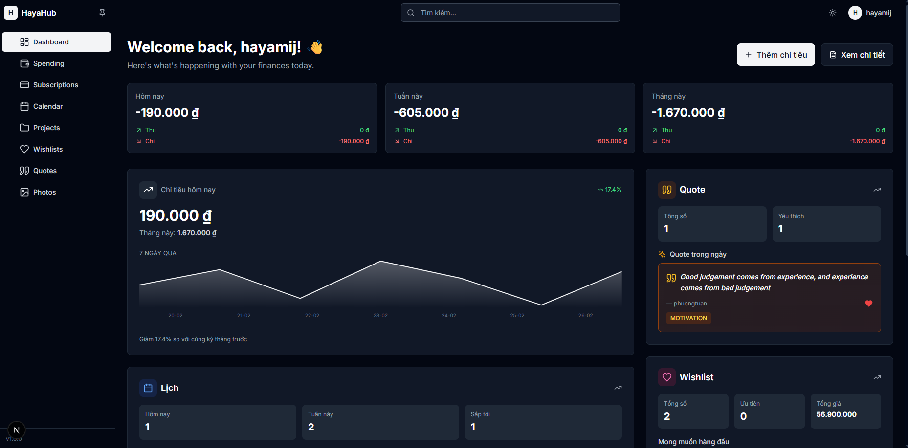
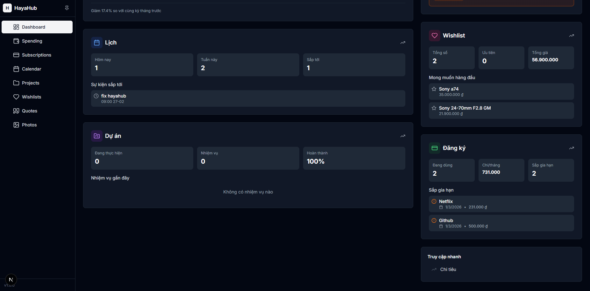
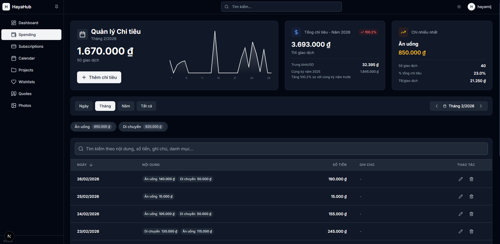
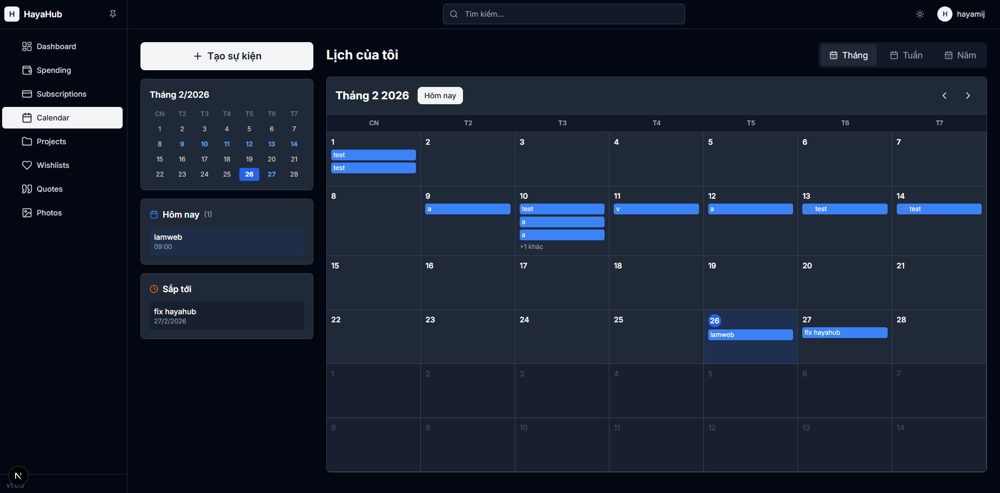
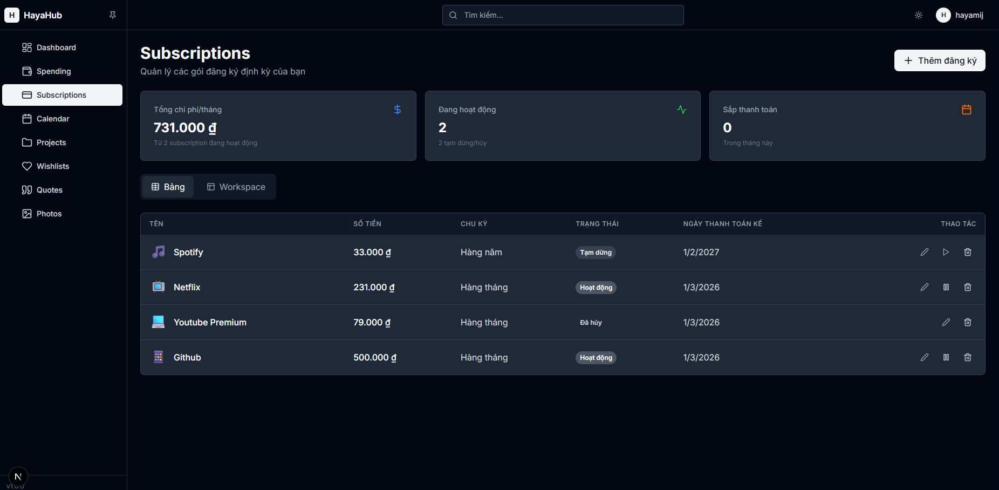
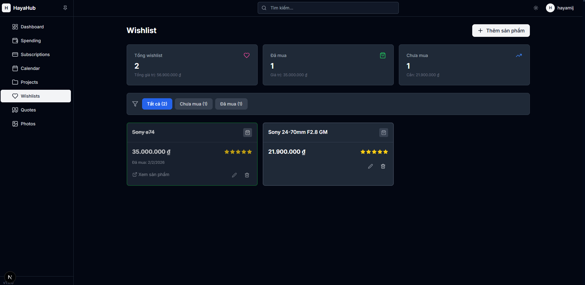
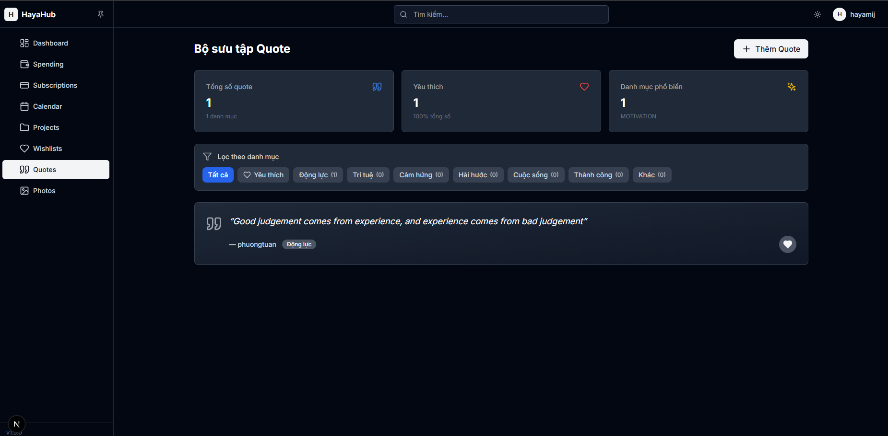
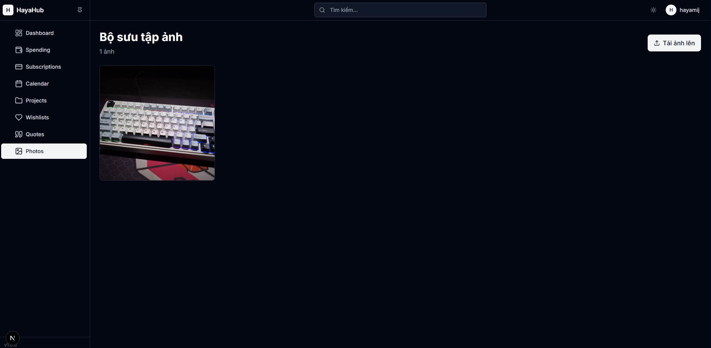

# HayaHub

<div align="center">

**All-in-One Personal Management Hub**

Modern productivity platform built with Clean Architecture, DDD, and React best practices.

[](https://nextjs.org/)
[](https://react.dev/)
[](https://www.typescriptlang.org/)
[](https://tailwindcss.com/)

</div>

## Overview

**HayaHub** combines expense tracking, project management, calendar, subscriptions, wishlist, quotes, and photo gallery into one cohesive platform.

**Key Highlights:**
- Clean Architecture with 4-layer separation
- Turborepo monorepo with 3 packages
- Hybrid Storage (LocalStorage + GitHub API)
- Offline-first with background sync
- ~900 LOC eliminated via generic patterns
- Full TypeScript strict mode

### Dashboard


*Dashboard widgets: calendar, quotes, wishlist, subscriptions*

### Expense Management

*Expense tracking with filters, charts, and statistics*

### Calendar

*Monthly calendar view with event management*

### Subscriptions

*Subscription tracking with payment cycles*

### Wishlist

*Wishlist with priority and price tracking*

### Quotes

*Quote management with categories and favorites*

### Photos

*Photo gallery with Cloudinary integration*

## Features

**Expense Management** - Track income/expenses with filtering, statistics, and presets  
**Calendar** - Event management with month/week/day views  
**Subscriptions** - Monitor recurring payments and costs  
**Projects & Tasks** - Organize projects with task tracking  
**Wishlist** - Item tracking with priorities and prices  
**Quotes** - Daily inspirational quote management  
**Photos** - Cloudinary-powered photo gallery  
**UI/UX** - Dark mode, responsive design, real-time sync

## Architecture

Clean Architecture with 4 layers:

```
Web (Next.js) → Infrastructure → Business → Domain
   Adapters        Repositories    Use Cases    Entities
   Components      Storage         DTOs         Rules
   Hooks           DI Container    Mappers      Validation
```

**Stats:** 46 Use Cases • 12 Entities • 11 Mappers • 31+ Hooks • 12 Repositories

## Tech Stack

- **Next.js 15** + React 18.3 + TypeScript 5.3
- **TailwindCSS 3.4** + Lucide Icons
- **Turborepo** + pnpm
- **LocalStorage** + GitHub API + Cloudinary
- **Vitest** for testing

**Patterns:** Clean Architecture, DDD, Strategy, Repository, DI, Mapper, Generic CRUD

## Structure

```
HayaHub/
├── apps/web/              # Next.js app
│   └── src/
│       ├── app/           # Pages (dashboard, expenses, calendar, etc.)
│       ├── components/    # React components
│       ├── hooks/         # Custom hooks (31+)
│       └── infrastructure/
│           ├── di/        # DI Container
│           ├── repositories/
│           └── storage/   # Hybrid storage strategies
├── packages/
│   ├── domain/           # Entities, value objects
│   ├── business/         # Use cases, DTOs, mappers
│   └── shared/           # Utilities
└── docs/                 # Screenshots & docs
```

## Quick Start

```bash
# Clone
git clone https://github.com/hayamij/HayaHub.git
cd HayaHub

# Install
pnpm install

# Environment (optional)
# Create apps/web/.env.local with GitHub/Cloudinary tokens

# Run
pnpm dev

# Open http://localhost:3000
```

**First use:** Navigate to `/register` → Create account → Login

## Development

```bash
pnpm dev           # Start dev server
pnpm build         # Build for production
pnpm type-check    # TypeScript check
pnpm lint          # Lint code
pnpm test          # Run tests
```

## Key Patterns

### Mapper Pattern
```typescript
class BaseMapper<TEntity, TDTO> {
  abstract toDTO(entity: TEntity): TDTO;
  abstract toDomain(dto: TDTO): TEntity;
  toDTOList(entities: TEntity[]): TDTO[];
}
```
Eliminates ~400 LOC of conversion code.

### Generic CRUD Hook
```typescript
useEntityCRUD<TEntity, TCreateDTO, TUpdateDTO>({
  getUseCase, createUseCase, updateUseCase, deleteUseCase
})
```
Eliminates ~500 LOC of repetitive hook code.

### DI Container
```typescript
// Always memoize container getters to prevent infinite loops
const useCase = useMemo(() => container.getMyUseCase, []);
```

## Deployment

**Vercel (Recommended):**
1. Import GitHub repo
2. Add environment variables
3. Push to deploy

**Manual:** `pnpm build` → Deploy `apps/web/.next`

## License

ISC License - see [LICENSE](LICENSE)

---

**Author:** [hayamij](https://github.com/hayamij) • **Repo:** [HayaHub](https://github.com/hayamij/HayaHub)
